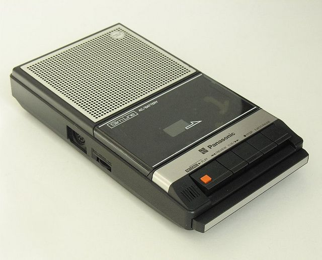
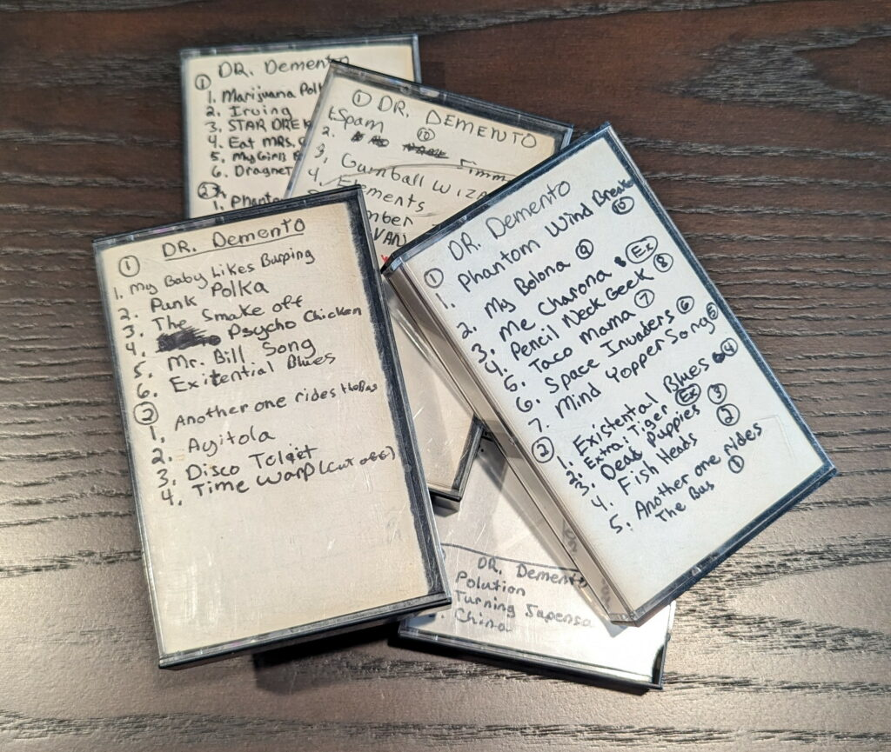
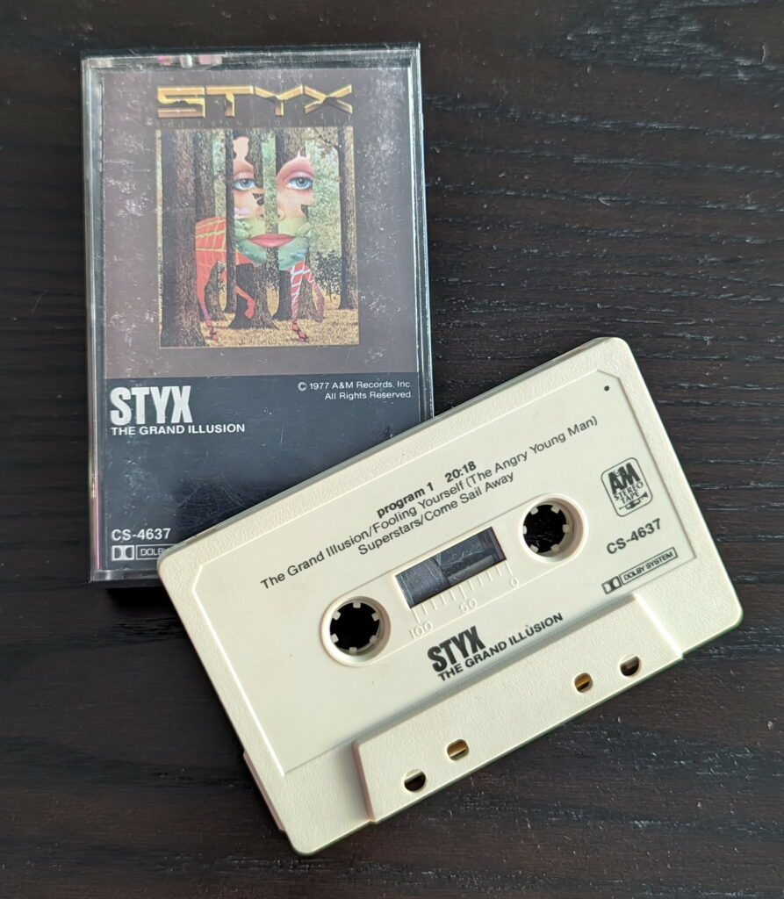

This entry deserves a double-feature, since it takes a look at the album that sparked the beginning of my obsession with music some 45 years ago. Not only did it introduce music to my life, but made me appreciate and seek out artists producing songs of substance and depth. Something that demanded attention and could sustain (and almost demand) an untold number of repeat listens. As I play this album today, it is just as powerful and engaging as it was when I first heard it from the tiny speaker of my childhood cassette recorder.

{/* more */}

Back in 1977, I was in the 6th grade and my only real exposure to music was that which my parents would listen to on occasion. I don't think they were big into music in general, but had a collection of albums from the likes of John Denver, Glen Campbell, Anne Murray, Kenny Rodgers, The Carpenters, etc. Pretty staple 1970s "easy listening" selections for the most part. I'd heard these songs enough to still have them etched in my brain, but nothing really captured my attention to any great degree. They did play a lot of [Jim Croce](https://en.wikipedia.org/wiki/Jim_Croce), and I do remember enjoying "Bad, Bad Leroy Brown" at the time with its humorous lyrics. _\[Side note - I would come to appreciate Jim Croce quite a bit much later in life, especially after a few documentaries on his tragically short life and the musical legacy he created.\]_

For my 10 year old ears, the only music I would actively seek out was that which appeared on the great [Dr. Demento](https://en.wikipedia.org/wiki/Dr._Demento) radio show. The good doctor would produce a weekly 4 hour show full of fun novelty and parody songs, broadcast from the Los Angeles rock station [KMET](https://en.wikipedia.org/wiki/KMET_\(FM\)) (a station that would make a much bigger impression on me later on as they played a great mix of progressive rock / hard rock / metal throughout the 70s and 80s). I would try to catch as much of the show as I could, and would usually record the "top ten" playlist towards the end of the show. This show is famously known as the springboard for ["Weird Al" Yankovic](https://en.wikipedia.org/wiki/%22Weird_Al%22_Yankovic)'s career.

The extent of my entertainment system at the time was running a line out cable from the family stereo to my trusty Panasonic tape recorder, which looked something like this...

<figure>

My Panasonic tape recorder circa 1977. Not my photo, since this unit disappeared decades ago. I kind of wish I still had it.

<figcaption>

</figcaption>

</figure>

I amassed quite a collection of tapes that I would play for friends and family, and listen to endlessly. I've kept a handful of these tapes all these years, as a sentimental reminder of a childhood well spent.

<figure>

Dr. Demento Tapes

<figcaption>

</figcaption>

</figure>

_So anyway, there's the opening act...time for the main attraction._

One day, my dad came home from work and handed me a cassette that one of his coworkers received as a gift, but didn't want. He thought I would like it because it had an interesting cover, and I was big into optical illusions at the time. I don't think he had any idea what kind of music was on the cassette, nor what kind of door this would unlock once I listened to it. Thanks dad.

Here is that very same battle worn cassette, another one of my prized possessions that I've held onto.

<figure>

Styx - The Grand Illusion

<figcaption>

</figcaption>

</figure>

The album [The Grand Illusion](https://en.wikipedia.org/wiki/The_Grand_Illusion) by Chicago rock band [Styx](https://en.wikipedia.org/wiki/Styx_\(band\)) opens in _grand_ fashion with the title track. A burst of staccato notes and a bit of bombast open this track followed by [Dennis DeYoung](https://en.wikipedia.org/wiki/Dennis_DeYoung)'s beckoning call,

> Welcome to the Grand illusion  
> Come on in and see what's happening  
> Pay the price, get your tickets for the show

Talk about a perfect opening for your first rock album. It certainly drew me in and even from the tiny speaker on my cassette recorder, it left a powerful initial impression.

<YouTube id="aIuCdQtNBgg" />

Styx - The Grand Illusion

Following the big opening, it gets more contemplative on the topic of fame and fortune, and how they aren't always as they appear. Familiar rhythms return along with reminders that beyond the trappings of fame, money, society, etc. we're really all the same. A couple of guitar solo sections build to the song's conclusion,

> Someday soon we'll stop to ponder what on earth's this spell we're under  
> We made the grade and still we wonder who the hell we are

Lyrics by DeYoung are straightforward, but carry a great message. This fact was not lost on me at the time. Although a 10 year old might not have the life experiences that the lyrics expressed, I appreciated that they were touching on something important and substantive that would require some thought and of course multiple replays of the album.

> Welcome to the Grand illusion  
> Come on in and see what's happening  
> Pay the price, get your tickets for the show  
> The stage is set, the band starts playing  
> Suddenly your heart is pounding  
> Wishing secretly you were a star  
>   
> But don't be fooled by the radio  
> The TV or the magazines  
> They show you photographs of how your life should be  
> But they're just someone else's fantasy  
>   
> So if you think your life is complete confusion  
> Because you never win the game  
> Just remember that it's a grand illusion  
> And deep inside we're all the same  
> We're all the same  
>   
> So if you think your life is complete confusion  
> Because your neighbors got it made  
> Just remember that it's a grand illusion  
> And deep inside we're all the same  
>   
> America spells competition, join us in our blind ambition  
> Get yourself a brand new motor car  
> Someday soon we'll stop to ponder what on earth's this spell we're under  
> We made the grade and still we wonder who the hell we are
> 
> Styx - The Grand Illusion (lyrics by Dennis DeYoung)

If that track hooked me right off the bat, the rest of the album sealed the deal. Great songs all the way through to the last track, The Grand Finale, which reprises themes from the album and comes full circle back to the beginning with the chorus from the title track. What a great way to end an album.

Listening to this album certainly feels like you are being led on a journey. Not quite a concept album, but there are common themes and threads throughout. Yet another aspect that would inform my later musical preferences, albums with themes or concepts that broached wider concepts and topics.

Besides the great songs on the album, another thing that captivated me was the fact that Styx had multiple lead singers in addition to great vocal harmonies. The majority of the album is sung by DeYoung, but [Tommy Shaw](https://en.wikipedia.org/wiki/Tommy_Shaw) takes lead on three tracks and [James "J.Y." Young](https://en.wikipedia.org/wiki/James_Young_\(American_musician\)) sings on one.

I loved Tommy Shaw's vocals and lyrics on his tracks, so I had to include a song from him as well (hence the length of this entry). This track has a great mournful tone and lyrics seemingly dealing with the emotional toll of his rise to fame with the band. These lyrics offer a more first person view to this topic when compared to The Grand Illusion. I learned much later that some of the lyrical inspiration came from his brother being sent off to fight in the Vietnam War. The vocals are sung with raw emotion (especially the outro) and an honesty that really makes this track shine and lyrics all the more meaningful.

<YouTube id="6WBX4WK49Js" />

Styx - Man In The Wilderness

> Another year has passed me by  
> Still I look a myself and cry  
> What kind of man have I become?  
> All of the years I've spent in search of myself  
> And I'm still in the dark  
> 'Cause I can't seem to find the light alone  
>   
> Sometimes I feel like a man in the wilderness  
> I'm a lonely soldier off to war  
> Sent away to die, never quite knowing why  
> Sometimes it makes no sense at all  
> Makes no sense at all  
>   
> Ten Thousand people look my way  
> But they can't see the way that I feel  
> Nobody even cares to try  
> I spend my life and sell my soul on the road  
> And I'm still in the dark  
> 'Cause I can't seem to find the light alone  
>   
> Sometimes I feel like a man in the wilderness  
> I'm a lonely sailor lost at sea  
> Drifting with the tide  
> Never quite knowing why  
> Sometimes it makes no sense at all  
>   
> (I'm alive)  
> Looking for love I'm a man with emotion  
> (And my heart's on fire)  
> I'm dying of thirst in the middle of the ocean  
> (I'm alive)  
>   
> Sometimes I feel like a man in the wilderness  
> I'm a lonely soldier off to war  
> Sent away to die, never quite knowing why  
> Sometimes it makes no sense  
> Sometimes it makes no sense  
> Sometimes it makes no sense at all  
> Makes no sense at all  
>   
> \[Outro\]  
> At all  
> Can't find the meaning of it all  
> Yeah  
> Can't find the light alone, oh
> 
> Styx - Man In The Wilderness (lyrics by Tommy Shaw)

The guitar solo leading into the conclusion and powerful outro really grab the listener. Shaw is a great vocalist and quite the complement / contrast to DeYoung's style. That's another thing about this album that has stuck with me, the diversity. There is just so much quality packed into its short 38 minute run time, that you can listen to it repeatedly and still enjoy it or find some new nuance that you hadn't noticed before. It is this sort of quality that really forged my tastes in music.

I wanted to hear more bands like this and shortly after receiving this album, I was on a quest. In the next year or so, I began accumulating albums (thanks Columbia House and BMG record clubs) and seeking out other bands that would touch me the way this album did. Luckily, by this time I began earning my own money delivering newspapers (stories printed in ink on dead trees and brought to your house during the Jurassic period before the internet) and spending most of it on my new addiction. I also had to upgrade the sound system cassette recorder, to bring these recordings to life. I would end up requesting either a Christmas or birthday gift of a spiffy Panasonic Technics all-in-one combo unit (radio, cassette, turntable, and separate speakers) that would serve me well on my musical exploration.

Styx would remain my favorite band for the next few years, and I consumed as much of their catalog as I could find at the time (the very early recordings eluded me until much later). The seed that The Grand Illusion planted led me to some truly outstanding bands that met or exceeded the bar set by this album. I'm sure many songs from those bands will be appearing on this site in the future. Stay tuned.

In the meantime, give this whole album a proper listen... on something better than a little Panasonic cassette recorder... dive into the lyrics, and enjoy the ride.
